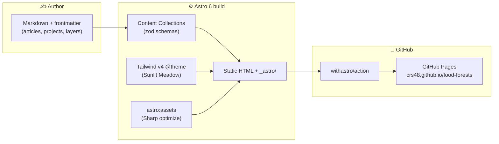
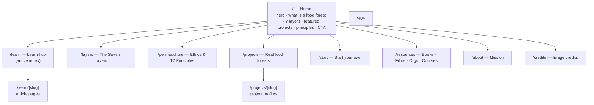
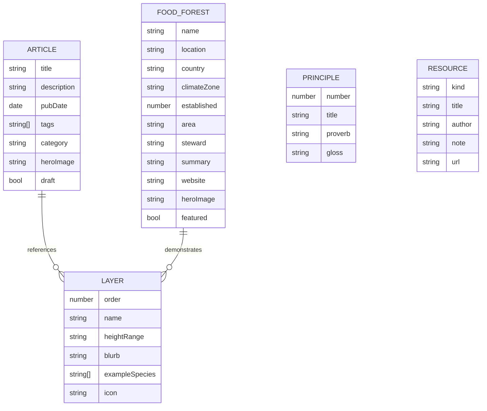
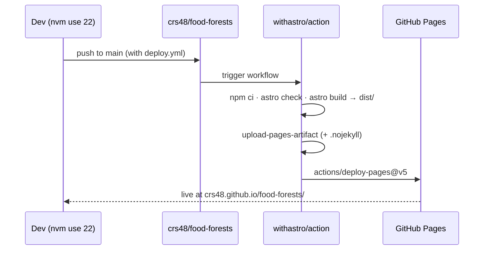

# Food Forest Website — A Solarpunk Home for Regenerative Agriculture

> An educational + inspirational GitHub Pages site about food forests,
> permaculture, and regenerative agriculture — built with Astro 6 and
> Tailwind CSS v4, dressed in a warm "solarpunk" aesthetic.

## Problem Statement

We want a beautiful, welcoming website whose first job is **education** and
**inspiration**: explain what food forests are, how permaculture works, and
showcase real people already stewarding regenerative land — so a curious
visitor leaves informed *and* moved to start their own patch of edible
forest. It should feel warm, cozy, and hopeful (a "solarpunk" mood), load
fast, cost nothing to host, and be trivially extensible with new articles
and project profiles over time.

Concretely, the site must:

- Teach the fundamentals (what a food forest is, the seven layers,
  permaculture ethics + 12 principles, how regenerative ag relates).
- Inspire (a lush landing page, profiles of real food forests and their
  stewards, a "start your own" on-ramp).
- Deploy for free on **GitHub Pages** with a clean CI/CD path.
- Be authored in Markdown so non-developers can contribute content.
- Ship a **pretty README** and a plan for photography/attribution.

Non-goals (for v1): user accounts, a CMS, e-commerce, a map app, comments,
or search. Education and inspiration first; everything else later.

## Executive Summary

Build a **statically-generated Astro 6 site** styled with **Tailwind CSS v4**
(CSS-first `@theme` tokens), deployed to GitHub Pages via the official
`withastro/action`. Content lives in **Astro Content Collections** (Markdown
+ zod-validated frontmatter) so articles, project profiles, and the seven
layers are data, not hand-coded HTML. The visual system is **"Sunlit
Meadow"** — warm cream, forest green, terracotta, and honey, set in
**Fraunces + Nunito Sans** — with organic SVG section dividers, soft radii,
subtle paper grain, and gentle motion gated behind `prefers-reduced-motion`.
A **"Forest Canopy"** dark mode mirrors it. Photography comes from
no-attribution stock (Unsplash/Pexels/Pixabay) plus CC0 botanical plates,
with a `/credits` page for anything requiring attribution.

The whole thing is free to host, fast (zero-JS by default), accessible
(AA-verified palette), and Markdown-authored so it grows without code.



## Current State In The Repository

This is a **greenfield repository** — there is no application code yet.

- `git status` shows **no commits**; the working tree contains only `.git/`
  and `.claude/` (the `explore` and `implement` skill definitions at
  `.claude/skills/explore/SKILL.md` and `.claude/skills/implement/`).
- There is **no `package.json`, no Astro project, no `docs/`** tree beyond
  this exploration.
- **No git remote** is configured yet. `gh` is authenticated as **`crs48`**
  (scopes include `repo` + `workflow`), so we can create
  `crs48/food-forests`, push, and enable Pages from here.
- Local toolchain: `git` user is *Chris Smothers*
  (`chris.smothers@gmail.com`); Node's default is **v23** (odd-numbered,
  **not supported by Astro 6**), but `nvm` has **v22.16.0** installed, which
  satisfies Astro 6's `>=22.12`. Build/dev commands must activate Node 22.

Implication: this doc defines the site from scratch, and the paired
`implement` skill will scaffold it, seed content, and ship it. Because the
repo is fresh and single-package, the `implement` skill's monorepo/CI
assumptions (pnpm workspaces, `changelog-section` check, "merge-commit only"
ruleset) **do not apply here** — there are no required checks to satisfy and
merges are unconstrained. We follow the *spirit* (branch → build → PR →
merge) without the monorepo scaffolding.

## External Research

Three focused research passes grounded this plan (full briefs summarized
below; sources in **References**).

### Technical stack (Astro + Tailwind + Pages)

- **Astro is at v6** (v6.4 mid-2026), **not v5** — a critical correction.
  Requires **Node ≥ 22.12** (dropped 18/20), uses **Vite 7**.
- **Tailwind v4** integrates via the **`@tailwindcss/vite`** plugin with a
  single `@import "tailwindcss";` — the old `@astrojs/tailwind` +
  `tailwind.config.js` + `@tailwind` directives approach is **deprecated**.
  Theme tokens live in CSS via **`@theme`**, auto-generating utilities
  (`bg-forest`, `text-terracotta`, `font-display`).
- **Content Collections** config lives at **`src/content.config.ts`** (top
  level), uses the `glob()` loader, and in v6 imports `z` from
  **`astro/zod`** (moved from `astro:content`). Render Markdown via the
  **`render()`** function, not the legacy `entry.render()`.
- **View transitions** use **`<ClientRouter />`** (from `astro:transitions`);
  `<ViewTransitions>` was **removed in v6**.
- **GitHub Pages**: official **`withastro/action@v6`** + `actions/deploy-pages@v5`,
  with repo **Pages source set to "GitHub Actions"**. For a project page,
  set `site: 'https://crs48.github.io'` and `base: '/food-forests'`; build
  links with `import.meta.env.BASE_URL` so the base path never breaks.
  `withastro/action` handles `.nojekyll` (needed so `_astro/` assets aren't
  eaten by Jekyll).
- **Images**: `astro:assets` `<Image />`/`<Picture />`; `src/` images are
  optimized at build time by **Sharp**; `public/` is copied as-is.

### Domain content (food forests / permaculture)

- **Food forest / forest garden**: a perennial, multi-layered polyculture
  that mimics a young woodland; lineage from **Robert Hart** (coined "forest
  gardening", 1980s), tropical homegardens, and Indigenous systems (the
  **Three Sisters** guild).
- **Seven layers** (canopy, sub-canopy, shrub, herbaceous, groundcover,
  root/rhizosphere, vertical/climber) — with **fungal** (and sometimes
  **aquatic**) added by some designers. Present 7 as canonical, not a fixed
  law.
- **Permaculture**: Mollison & Holmgren, 1970s; **3 ethics** (Earth Care,
  People Care, Fair Share) and **Holmgren's 12 principles** (with their
  proverbs). Supporting concepts: zones 0–5, guilds, swales, hügelkultur,
  nitrogen fixers, stacking functions, succession.
- **Regenerative agriculture**: soil-rebuilding *practices* for working
  farms (no-till, cover crops, holistic grazing) — overlaps but is distinct
  from permaculture (a *design methodology*) and food forests (a *technique*).
- **Nine real projects** verified to feature: Beacon Food Forest (Seattle),
  Browns Mill (Atlanta — actually the largest US public food forest),
  Martin Crawford / ART (Devon), Geoff Lawton (Zaytuna / Greening the
  Desert), Ernst Götsch (syntropic, Brazil), The Food Forest (Gawler, AU),
  Las Cañadas (Mexico), Ridgedale (Sweden), Wakelyns (Suffolk).
- **Accuracy flags** to honor: attribute "largest US public food forest" to
  Browns Mill (not Beacon); frame Savory's claims as contested; Götsch is
  Swiss-born; keep permaculture ≠ regenerative ≠ food-forest distinctions
  crisp.

### Design system (solarpunk + assets)

- **Solarpunk** = optimistic ecological futurism; Art-Nouveau organic
  linework, abundant greenery, warm sunlight, community, handcrafted feel.
  Guardrail: stay **editorial and restrained** — light, whitespace, one or
  two botanical accents per view, real photography over clip-art.
- **"Sunlit Meadow" palette** (AA-verified): cream `#FBF7EC`, ink `#26301F`,
  forest `#2F5233`, leaf `#4E7A3E`, moss `#7B8B5E`, terracotta `#C05C36`,
  clay `#B87333`, honey `#C08A2E`, sky `#7FB2C4`, soil `#5A4632`. Dark mode
  = **"Forest Canopy"** (deep `#12211A`, parchment text `#E8E4D3`, lighter
  leaf/amber accents).
- **Type**: **Fraunces** (display serif, optical-size axis) + **Nunito Sans**
  (or Inter) body — self-hosted via Fontsource.
- **Motifs**: organic SVG section dividers (`preserveAspectRatio="none"`),
  soft radii, subtle paper grain (~3–6% opacity), recolored CC0 botanical
  plates, gentle micro-interactions — all motion gated behind
  `prefers-reduced-motion`.
- **Icons**: **Lucide** (ISC) for UI chrome; **Phosphor** thin/duotone (MIT)
  for decorative nature icons.
- **Photography**: Unsplash/Pexels/Pixabay need **no attribution** on direct
  download (but grant no model releases — avoid identifiable faces implying
  endorsement); CC-BY/Wikimedia/Openverse need a linked **TASL** credit;
  CC0 botanical plates from **BHL/rawpixel**. Keep a `credits` manifest and a
  `/credits` page.

## Key Findings

1. **Astro 6 + Content Collections is the right backbone.** Markdown-authored,
   zod-validated content becomes typed data; per-entry pages are generated at
   build via `getStaticPaths()`. Zero JS ships by default → fast + accessible.
2. **Tailwind v4's CSS-first `@theme` is a gift for a custom palette.** The
   whole "Sunlit Meadow" system lives in one `global.css`, and dark mode is a
   `prefers-color-scheme` override of semantic aliases.
3. **The base-path is the #1 deploy footgun.** A project page served under
   `/food-forests/` breaks any hardcoded `/`-rooted link or asset. Centralize
   URL-building through `import.meta.env.BASE_URL` and never hardcode.
4. **Node 23 will fail the build.** CI uses Node 22 automatically via
   `withastro/action`; locally we must `nvm use 22`.
5. **Content accuracy is a feature.** This is educational; the domain brief's
   accuracy flags (Browns Mill vs Beacon, Savory framing, layer-count
   nuance) must be reflected in the seed content.
6. **The aesthetic risk is kitsch.** Restraint (light, whitespace, editorial
   type, sparse botanical accents) is what separates "lovely and warm" from
   "cartoon leaves everywhere."

## Options And Tradeoffs

### Framework

| Option | Pros | Cons | Verdict |
|---|---|---|---|
| **Astro 6** | Content-first, zero-JS default, MD collections, first-class Pages action, islands when needed | Newer major (v6) has a couple of gotchas | ✅ **Chosen** — exactly a content/education site |
| Next.js (static export) | Familiar, huge ecosystem | Heavier, React-by-default ships JS, overkill for static content | ❌ Too much runtime for a brochure/education site |
| Eleventy | Tiny, flexible, great for MD | Less batteries-included (no image pipeline/islands), more wiring | ⚠️ Fine, but Astro gives more out of the box |
| Plain HTML + Tailwind CLI | Zero framework | No content model, no reuse, painful to scale content | ❌ Doesn't scale to many articles/profiles |

### Styling

| Option | Verdict |
|---|---|
| **Tailwind v4 (`@tailwindcss/vite`, `@theme`)** | ✅ **Chosen** — CSS-first tokens, no config file, fast |
| Tailwind v3 (`@astrojs/tailwind` + config) | ❌ Deprecated path in current Astro |
| Vanilla CSS / CSS Modules | ⚠️ Workable but slower to build a consistent system |
| UI kit (DaisyUI, shadcn) | ❌ Fights the bespoke solarpunk look |

### Content architecture

- **Content Collections (Markdown)** for `articles`, `foodForests`, `layers`
  — the volume-y, author-often content. ✅
- **Typed TS data modules** for `principles` (3 ethics + 12), `resources`
  (books/films/orgs), and `nav` — small, structured, rarely-edited, benefits
  from being code. ✅
- Alternative (everything in collections) rejected: overkill for a fixed
  12-item principles list.

### Hosting

- **GitHub Pages + `withastro/action`** ✅ — free, official, matches the ask.
- Netlify/Vercel/Cloudflare Pages — great DX but the user explicitly asked
  for GitHub Pages. ❌ for v1 (easy to add later; just change deploy target).

### Dark mode

- **`prefers-color-scheme` only** (no toggle) for v1 ✅ — simplest, zero JS,
  respects OS. A manual toggle (needs a tiny island + localStorage) is a
  fast-follow.

## Recommendation

Build the **Astro 6 + Tailwind v4** static site described above, deployed to
**`crs48/food-forests`** on GitHub Pages at
**`https://crs48.github.io/food-forests/`**.

**Information architecture** (pages):



**Content model** (collections + data):



**Design tokens** are the "Sunlit Meadow" palette in a Tailwind v4 `@theme`
block with semantic aliases (`--color-bg`, `--color-primary`,
`--color-accent`) overridden under `prefers-color-scheme: dark`.

**Deploy pipeline**:



**Sequencing**: scaffold → design tokens/fonts → layout + nav/footer →
reusable components → content collections + seed content → pages → SEO
(sitemap/rss/robots) → deploy workflow + README → create repo, push, enable
Pages, merge, verify live.

## Example Code

**`astro.config.mjs`** (project-page base + Tailwind v4 + sitemap):

```js
// @ts-check
import { defineConfig } from 'astro/config';
import tailwindcss from '@tailwindcss/vite';
import sitemap from '@astrojs/sitemap';

export default defineConfig({
  site: 'https://crs48.github.io',
  base: '/food-forests',
  integrations: [sitemap()],
  vite: { plugins: [tailwindcss()] },
});
```

**`src/styles/global.css`** (Sunlit Meadow tokens + dark mode):

```css
@import "tailwindcss";
@import "@fontsource-variable/fraunces";
@import "@fontsource-variable/nunito-sans";

@theme {
  --color-cream: #FBF7EC;   --color-parchment: #F3ECD9;
  --color-ink: #26301F;     --color-forest: #2F5233;
  --color-leaf: #4E7A3E;    --color-moss: #7B8B5E;
  --color-terracotta: #C05C36; --color-clay: #B87333;
  --color-honey: #C08A2E;   --color-sky: #7FB2C4;
  --color-soil: #5A4632;
  --font-display: "Fraunces Variable", ui-serif, Georgia, serif;
  --font-body: "Nunito Sans Variable", ui-sans-serif, system-ui, sans-serif;
}

:root {
  --bg: var(--color-cream); --surface: var(--color-parchment);
  --text: var(--color-ink); --primary: var(--color-forest);
  --accent: var(--color-terracotta);
}
@media (prefers-color-scheme: dark) {
  :root {
    --bg: #12211A; --surface: #1C3025; --text: #E8E4D3;
    --primary: #7FB069; --accent: #E0A458;
  }
}
@media (prefers-reduced-motion: reduce) {
  *, *::before, *::after {
    animation-duration: .01ms !important; animation-iteration-count: 1 !important;
    transition-duration: .01ms !important; scroll-behavior: auto !important;
  }
}
```

**`src/content.config.ts`** (v6 — `z` from `astro/zod`):

```ts
import { defineCollection } from 'astro:content';
import { glob } from 'astro/loaders';
import { z } from 'astro/zod';

const articles = defineCollection({
  loader: glob({ pattern: '**/*.md', base: './src/content/articles' }),
  schema: z.object({
    title: z.string(),
    description: z.string(),
    pubDate: z.coerce.date(),
    category: z.enum(['basics', 'design', 'plants', 'regenerative']),
    tags: z.array(z.string()).default([]),
    heroImage: z.string().optional(),
    draft: z.boolean().default(false),
  }),
});

const foodForests = defineCollection({
  loader: glob({ pattern: '**/*.md', base: './src/content/food-forests' }),
  schema: z.object({
    name: z.string(), location: z.string(), country: z.string(),
    climateZone: z.string().optional(), established: z.number().optional(),
    area: z.string().optional(), steward: z.string().optional(),
    summary: z.string(), website: z.string().url().optional(),
    heroImage: z.string().optional(), featured: z.boolean().default(false),
  }),
});

const layers = defineCollection({
  loader: glob({ pattern: '**/*.md', base: './src/content/layers' }),
  schema: z.object({
    order: z.number(), name: z.string(), heightRange: z.string(),
    exampleSpecies: z.array(z.string()).default([]), icon: z.string().default('leaf'),
  }),
});

export const collections = { articles, foodForests, layers };
```

**Base-path-safe link helper** (`src/lib/url.ts`):

```ts
const base = import.meta.env.BASE_URL; // e.g. "/food-forests/"
export const href = (path = '') =>
  (base.replace(/\/$/, '') + '/' + path.replace(/^\//, '')).replace(/\/$/, '') || '/';
```

## Risks And Open Questions

- **Node version drift.** Local default is Node 23 (unsupported). *Mitigation:*
  `nvm use 22.16.0` before every `astro` command; document in README; CI is
  unaffected (`withastro/action` pins its own Node).
- **Base-path link breakage.** *Mitigation:* an `href()` helper +
  `import.meta.env.BASE_URL`; a validation step greps built HTML for stray
  `href="/"`-rooted internal links.
- **Photography licensing / faces.** Stock licenses grant copyright but not
  model releases. *Mitigation:* prefer landscape/plant/hands-in-soil shots
  over identifiable faces; keep a `credits` manifest + `/credits` page;
  ship with a small set of curated CC0/no-attribution images and clearly
  document swap-in points. *Open:* do we hand-pick real photos now or ship
  tasteful CSS/SVG gradients + botanical line-art placeholders first? (v1:
  ship gradient/illustration placeholders + a documented image slot so the
  build never depends on unlicensed assets.)
- **Content accuracy.** *Mitigation:* encode the domain brief's accuracy
  flags directly in seed content; cite sources on each profile.
- **Action version pins** (`withastro/action@v6`, `deploy-pages@v5`) may bump.
  *Mitigation:* note in README to re-check; pins are current as of mid-2026.
- **Custom domain?** Out of scope for v1 (would drop `base`, add `public/CNAME`).
- **Dark-mode toggle** (vs OS-only) deferred to a fast-follow island.

## Implementation Checklist

- [x] Scaffold Astro 6 project: `package.json` (scripts: dev/build with
      `astro check && astro build`/preview), `astro.config.mjs`
      (`site`+`base`+sitemap+Tailwind vite plugin), `tsconfig.json`,
      `.gitignore` (node_modules, dist, .astro, .claude), `.nvmrc` (22.16.0).
- [x] Install deps: `astro`, `@tailwindcss/vite`, `tailwindcss`,
      `@astrojs/sitemap`, `@astrojs/rss`, `@fontsource-variable/fraunces`,
      `@fontsource-variable/nunito-sans`, `sharp`.
- [x] Design system: `src/styles/global.css` with Sunlit Meadow `@theme`
      tokens, semantic aliases, Forest Canopy dark mode, reduced-motion guard,
      base typography + prose styles.
- [x] `src/lib/url.ts` base-path-safe `href()` helper + `src/lib/site.ts`
      site metadata (title, description, nav, social).
- [x] `BaseLayout.astro`: `<head>` SEO (title/description/OG/canonical),
      fonts, `<ClientRouter />`, skip-link, `global.css` import; slots.
- [x] `Header.astro` (sticky nav, mobile menu, base-safe links) +
      `Footer.astro` (nav, credits link, tagline).
- [x] Reusable components: `Button.astro`, `Card.astro`, `SectionDivider.astro`
      (organic SVG, `preserveAspectRatio="none"`), `Prose.astro`,
      `Leaf`/`Icon` helper (Lucide/Phosphor inline SVG), `Hero.astro`.
- [x] `src/content.config.ts` with `articles`, `foodForests`, `layers`
      collections (zod schemas, `astro/zod` import).
- [x] Seed `layers` content: all 7 layers (+ note on fungal/aquatic 8th/9th),
      with height ranges and example species.
- [x] Seed `foodForests` content: the 9 verified profiles with accurate
      facts + accuracy flags (Browns Mill = largest US; Savory contested;
      Götsch Swiss-born) and source links.
- [x] Seed `articles` content: ≥5 starter articles (what is a food forest;
      the seven layers; permaculture ethics & principles; guilds & companion
      planting; regenerative vs permaculture; start small).
- [x] Data modules: `src/data/principles.ts` (3 ethics + Holmgren's 12 with
      proverbs) and `src/data/resources.ts` (books/films/orgs/courses).
- [x] Home page `/`: hero, "what is a food forest", seven-layers preview,
      featured projects, principles teaser, "start your own" CTA, closing.
- [x] Learn hub `/learn` (article index, grouped by category) + `/learn/[slug]`
      dynamic article pages (`getStaticPaths` + `render()`), with prose styling.
- [x] `/layers` page: visual, ordered walkthrough of the seven layers.
- [x] `/permaculture` page: 3 ethics + 12 principles (from data module).
- [x] `/projects` index + `/projects/[slug]` profile pages (facts panel,
      summary, website + source links).
- [x] `/start` page: beginner on-ramp (observe → sun/water/soil → zone →
      guild → start small → patience), linking to articles.
- [x] `/resources` page (books/films/orgs/courses from data) + `/about` +
      `/credits` (image + content attributions) + custom `/404`.
- [x] SEO plumbing: `@astrojs/sitemap`, `src/pages/rss.xml.js` feed,
      `public/robots.txt`, `public/favicon.svg`, per-page OG metadata.
- [x] `.github/workflows/deploy.yml` using `withastro/action@v6` +
      `actions/deploy-pages@v5` (triggers on push to `main`).
- [x] Pretty `README.md`: hero blurb, screenshots/placeholder, live URL,
      local-dev (nvm note), content-authoring guide, tech stack, license,
      credits pointer.
- [ ] Create GitHub repo `crs48/food-forests`, push, set Pages source to
      "GitHub Actions", merge to `main`, confirm the deploy workflow runs.

## Validation Checklist

- [x] `nvm use 22.16.0 && npm run build` completes with **no errors**
      (`astro check` clean, `dist/` produced).
- [x] `npm run preview` serves the site and every nav route renders (home,
      learn + an article, layers, permaculture, projects + a profile, start,
      resources, about, credits, 404).
- [x] No broken internal links: built HTML has no hardcoded `href="/..."`
      that bypasses the `/food-forests/` base (spot-check + grep `dist/`).
- [x] Content accuracy spot-check: Browns Mill labeled largest US public food
      forest; seven layers present with fungal/aquatic note; 12 principles
      match Holmgren; Savory framed as contested.
- [x] Accessibility sanity: AA contrast holds (Sunlit Meadow), images have
      `alt`, there's a skip-link, headings are ordered, focus states visible.
- [x] Dark mode renders correctly under `prefers-color-scheme: dark`; motion
      is suppressed under `prefers-reduced-motion: reduce`.
- [x] `sitemap-index.xml`, `rss.xml`, and `robots.txt` are emitted in `dist/`.
- [ ] The GitHub Actions **deploy workflow succeeds** and the site is live at
      `https://crs48.github.io/food-forests/` with working styling + links.

## References

**Technical**
- [Astro 6.0 release](https://astro.build/blog/astro-6/) ·
  [Install & setup](https://docs.astro.build/en/install-and-setup/) ·
  [Upgrade to v6](https://docs.astro.build/en/guides/upgrade-to/v6/)
- [Deploy to GitHub Pages](https://docs.astro.build/en/guides/deploy/github/)
- [Content Collections](https://docs.astro.build/en/guides/content-collections/) ·
  [Images](https://docs.astro.build/en/guides/images/) ·
  [View transitions](https://docs.astro.build/en/guides/view-transitions/)
- [Tailwind CSS v4](https://tailwindcss.com/blog/tailwindcss-v4) ·
  [Tailwind + Astro install](https://tailwindcss.com/docs/installation/framework-guides/astro)
- [@astrojs/sitemap](https://docs.astro.build/en/guides/integrations-guide/sitemap/) ·
  [@astrojs/rss](https://docs.astro.build/en/guides/integrations-guide/rss/)

**Domain**
- [Robert Hart (horticulturist) — Wikipedia](https://en.wikipedia.org/wiki/Robert_Hart_(horticulturist)) ·
  [Nine layers of the edible forest garden](https://tcpermaculture.com/site/2013/05/27/nine-layers-of-the-edible-forest-garden/)
- [Permaculture — Wikipedia](https://en.wikipedia.org/wiki/Permaculture) ·
  [Permaculture ethics](https://permacultureprinciples.com/ethics/) ·
  [Holmgren's 12 principles](https://deepgreenpermaculture.com/a-comprehensive-guide-to-david-holmgrens-permaculture-design-principles/)
- [Regenerative agriculture — Wikipedia](https://en.wikipedia.org/wiki/Regenerative_agriculture)
- [Three Sisters — USDA NAL](https://www.nal.usda.gov/collections/stories/three-sisters)
- Projects: [Beacon Food Forest](https://en.wikipedia.org/wiki/Beacon_Food_Forest) ·
  [Browns Mill (Conservation Fund)](https://www.conservationfund.org/our-impact/projects/urban-food-forest-at-browns-mill/) ·
  [Agroforestry Research Trust](https://www.agroforestry.co.uk/about_us/) ·
  [Greening the Desert](https://www.greeningthedesertproject.org/about-us/) ·
  [Agenda Gotsch](https://agendagotsch.com/en/) ·
  [The Food Forest (Gawler)](https://www.foodforest.com.au/about-us/about-the-food-forest/) ·
  [Las Cañadas](https://bosquedeniebla.com.mx/) ·
  [Ridgedale](https://www.ridgedalepermaculture.com/) ·
  [Wakelyns](https://wakelyns.co.uk/agroforestry/)

**Design & assets**
- [Solarpunk — Wikipedia](https://en.wikipedia.org/wiki/Solarpunk) ·
  [ACMI: Solarpunk on screen](https://www.acmi.net.au/stories-and-ideas/an-introduction-to-solarpunk-on-screen-acmi/)
- Fonts: [Fraunces](https://fonts.google.com/specimen/Fraunces) ·
  [Nunito Sans](https://fonts.google.com/specimen/Nunito+Sans) · [Fontsource](https://fontsource.org/)
- Icons: [Lucide](https://lucide.dev/) · [Phosphor](https://phosphoricons.com/)
- Photos/licenses: [Unsplash](https://unsplash.com/license) ·
  [Pexels](https://www.pexels.com/license/) · [Pixabay](https://pixabay.com/service/license-summary/) ·
  [Openverse](https://openverse.org/) · [Wikimedia reuse](https://commons.wikimedia.org/wiki/Commons:Reusing_content_outside_Wikimedia) ·
  [Biodiversity Heritage Library](https://www.flickr.com/photos/biodivlibrary/)
